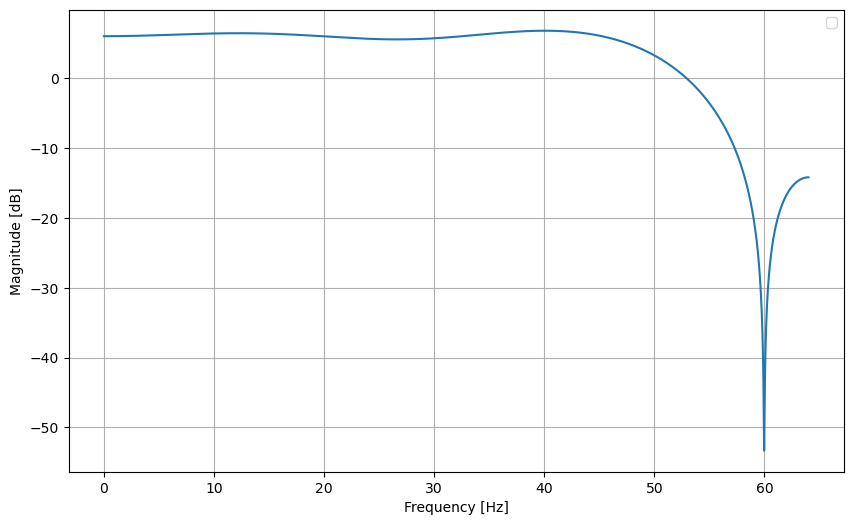
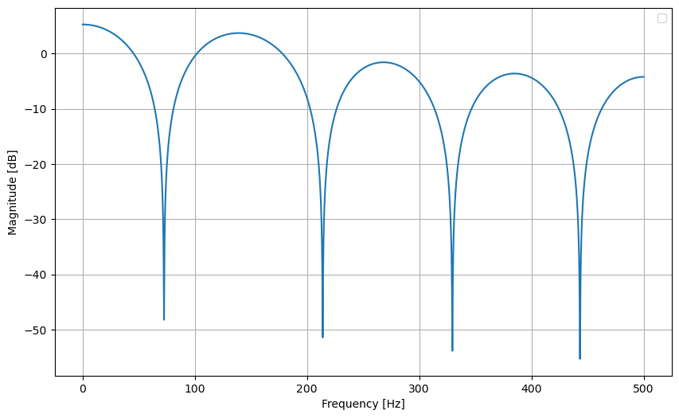

## Introdução.

O repositório atual tem como objetivo projetar filtros FIR em hardware e analisar suas respostas a sinais ECGs (sinais de eletrocardiograma). Nesse repositório existem duas categorias de filtros. A primeira categoria é o Hardware preciso o qual se utiliza de componentes sem aproximação. Por sua vez, a segunda trata-se de filtros com componentes de arquiteturas aproximadas.

O foco da analise é comparar o desempenho do consumo energético, da área, do delay e da precisão dos circuitos aproximados em relação ao circuito preciso. As simulações foram realizadas pelo software xcelium, já a precisão foi analisada via python e as demais características foram analisadas via Genus.

## Circuitos aproximados.

Os circuitos aproximados utilizados foram somadores obtidos da biblioteca EvoApproxLib Lite e 
do artigo "*Automatically Generating Approximate Circuits: A Methodology Based on Boolean Satisfiability*". Da biblioteca, foram selecionados apenas somadores de 16bits com sinal e das categorias *MSE vs Power* e *MRE vs power*. O repositório não pretende entrar em detalhes quanto a construção dos circuitos.

## Amostras utilizadas.

As amostras utilizadas foram a gravação 16265 do *MIT-BIH normal sinus rhythm database 1.0.0*, já a segunda foi uma amostra gerada pela biblioteca do python chamada *neurokit2* utilizando a função *ecg_simulate* e adicionado um ruido *PLI* (nterferência de linha de energia) de 60Hz a forma de onda. A primeira amostra tem uma frequência de amostragem de 128 Hz, já a segunda tem uma frequência de amostragem de 1kHz.
## Filtro FIR.

O diagrama utilizado para projetar o filtro foi o seguinte:

Onde T são dispositivos de memoria que são acionados apenas na mudança de clock, e h são os coeficientes do filtro. No caso atual, os filtros tem um total de 9 pesos, ou ordem M=8.

Onde a equação do filtro pode ser definida da seguinte forma:
$y=\sum_{m=0}^{M+1} h(m)x(n-m)$

Para calcular os coeficientes, foi-se utilizado um algoritmo *Normalized Least Mean Squares (NLMS)* que é uma variante do *LMS (Least Mean Squares)* que é utilizado para adaptar os coeficientes de um filtro FIR (Finite Impulse Response) de forma eficiente. Ele é amplamente utilizado em aplicações de filtragem adaptativa devido à sua simplicidade e eficiência computacional.

Foram obtidos os seguintes coeficientes:
1. Para a amostra do banco de dados:[ -0.05687452,  0.10645178, -0.13459433, 0.16681913,  0.83544458, 0.16914218, -0.13559919,  0.1064614 , -0.05718422]
2. Para a amostra criada artificialmente: [0.2521989 ,  0.14826541,  0.06128362, 0.00359539, -0.01659624, 0.00362078,  0.06145873,  0.14882257,  0.25344781]

O diagrama de Bode dos filtros são:

Para a amostra do banco de dados:

Para a amostra criada artificialmente:

Dado os valores de magnitude, é possível perceber que existe um ganho presente. O ganho se deve ao fato do filtro ter um fator de ganho de 2x.

Fazendo a analise dos valores do filtro e a analise dos diagramas, é possível perceber que os filtros tratam-se de filtros passa-baixas com frequência de corte de 60Hz, a mesma frequência presente no ruido que se deseja remover, o ruido PLI.

## Simulações e Análises de Precisão.

Para realizar a simulação de cada um dos filtros, primeiro foi necessário a criação do RTL de cada filtro, a linguagem de descrição de hardware escolhida foi a SystemVerilog, o qual foi utilizado a aritmética de ponto fixo com 12 bits direcionado a para a parte fracionaria e 4 bits para a parte inteira, totalizando 16 bits para os dados de entrada e saída do filtro. Logo após a simulação foi realizada, e os dados da simulação foram armazenados em artigos .txt. Em seguida, iniciou-se a etapa de analise dos dados a qual duas principais métricas foram utilizadas para a analise de precisão das amostras o *Mean Squared Error(MSE)* e o *Signal Noise Ratio(SNR)*. Foi-se estruturado uma tabela para expor cada uma das métricas de cada somador. A tabela é a seguinte:

Sinal do banco de dados:

|     Somador     |       SNR(dB)       |           MSE          |
|:---------------:|:-------------------:|:----------------------:|
| SOMADOR PRECISO | -1.3850743589611123 |           0.0          |
|       2T2       | -1.3852340269997445 |  1.028363504413793e-05 |
|       2TN       | -1.3852356101894365 |  5.960464477539063e-08 |
|       2U6       | -1.3855141001948057 | 3.9610898295210524e-07 |
|       2UB       | -1.3892102920504956 |   7.5776462217174e-05  |
|       2UY       | -1.3850743589611123 |           0.0          |
|       2X2       | -1.3859933952119228 | 1.6827242371837426e-06 |
|       2YM       | -1.3857936581881871 | 1.0974183648827344e-05 |
|       3BD       | -1.3914948199035473 |  0.0006757635454696065 |
|       32R       |  -1.365153790351554 |  0.0005810896317205644 |
|       32T       | -1.3745992095763417 | 0.00025263632175338217 |
|       35M       | -1.3857936581881871 | 1.0974183648827344e-05 |
|       334       | -1.3873435714690407 | 2.1369268798770763e-05 |
|       349       | -1.3866395472528432 |  6.490327712450592e-06 |
|       EMB       |  -1.340432739879072 |  0.002512519288173472  |

Sinal gerado de forma artificial:

|     Somador     |       SNR(dB)      |           MSE          |
|:----------------------:|:------------------------:|:----------------------:|
| SOMADOR PRECISO | 15.637162133413302 |           0.0          |
|       2T2       | 15.645130283448907 |  9.362473346219205e-06 |
|       2TN       |  15.63909692433912 |  5.960464477539063e-08 |
|       2U6       |  15.64679767888072 |  1.74437419022664e-06  |
|       2UB       | 15.633580428053795 | 2.1491629062312665e-05 |
|       2UY       | 15.637162133413302 |           0.0          |
|       2X2       | 15.647812963569196 | 1.9994348582654897e-06 |
|       2YM       | 15.759521632664729 | 0.00028678133346066615 |
|       3BD       | 15.774431848688447 |  0.0005017473201940555 |
|       32R       |  15.50598146496197 | 0.00025218663829388005 |
|       32T       |  15.61557697256159 |  8.618358338233267e-05 |
|       35M       | 15.649092669102473 |  9.572057440729425e-06 |
|       334       | 15.675049087289196 |  2.544286817607313e-05 |
|       349       |  15.6451949673307  | 2.1977471833181853e-06 |
|       EMB       |  15.72145955388181 |  0.0018918078960758625 |

Vale salientar que o somador EMB é o somador proposto no artigo: *Automatically Generating Approximate Circuits: A Methodology Based on Boolean Satisfiability*.

## Síntese e Analise de Área, Consumo e Desempenho.

A síntese foi realizado com o PDK de 180nm e 4ns de duração de clock. Com a ajuda da ferramenta da Cadence, o Genus, foi possível obter os dados para analisar as métricas do hardware. Segue a tabela com os valores de todas as metricas.

|     Somador     | Área (um²) | Consumo(W)  | Datapath(ps) |
|:---------------:|:----------:|-------------|:------------:|
| SOMADOR PRECISO | 36667.754  | 6.38817e-04 |     8090     |
|       2T2       |  21311.642 | 3.16675e-04 |     6639     |
|       2TN       |  21285.730 | 2.98849e-04 |     6441     |
|       2U6       |  22782.226 | 3.31367e-04 |     6656     |
|       2UB       |  19515.770 | 2.84252e-04 |     6273     |
|       2UY       |  21285.730 | 2.98597e-04 |     6226     |
|       2X2       |  21080.379 | 3.04536e-04 |     6441     |
|       2YM       |  20464.325 | 3.00958e-04 |     6639     |
|       3BD       |  17621.815 | 2.62845e-04 |     5879     |
|       32R       |  18947.796 | 2.73931e-04 |     6028     |
|       32T       |  18629.273 | 2.66706e-04 |     6028     |
|       35M       |  31167.923 | 4.97681e-04 |     7721     |
|       334       |  22206.498 | 3.21905e-04 |     6676     |
|       349       |  20596.810 | 2.91334e-04 |     6159     |
|       EMB       |  13684.729 | 3.39000e-04 |     3578     |

## Conclusão.

Com os dados informados é possível distinguir qual o melhor somador para cada aplicação e assim, é possível tomar uma decisão mais cabível a depender das circunstancias. Qualquer duvida, estou a disposição e estou anexando os códigos para  caso seja necessário a análise.
