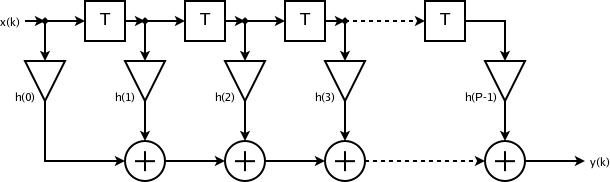
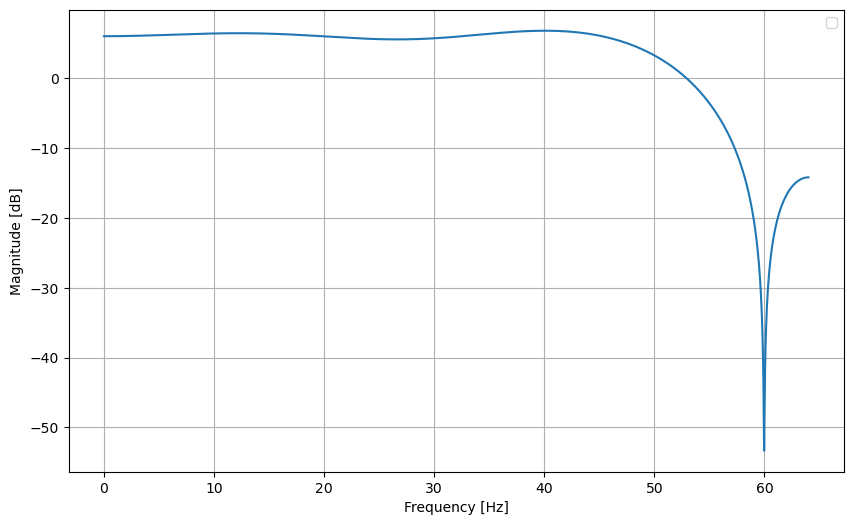
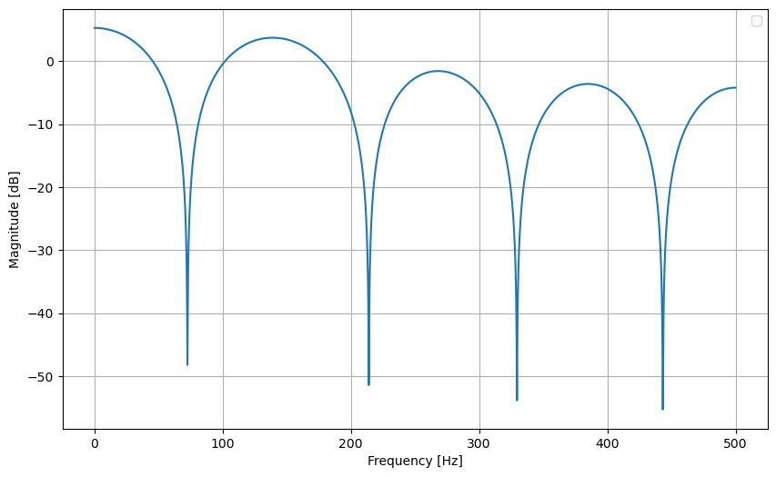

## Introduction

The current repository aims to design FIR filters in hardware and analyze their responses to ECG signals (electrocardiogram signals). In this repository, there are two categories of filters. The first category is precise hardware that uses non-approximate components. The second category deals with filters with components of approximate architectures.

The focus of the analysis is to compare the performance of energy consumption, area, delay, and precision of the approximate circuits in relation to the precise circuit. The simulations were carried out using xcelium software, while the precision was analyzed via Python and the other characteristics were analyzed using Genus.

## Approximate Circuits

The approximate circuits used were adders obtained from the EvoApproxLib Lite library and from the paper "Automatically Generating Approximate Circuits: A Methodology Based on Boolean Satisfiability". From the library, only 16-bit signed adders from the MSE vs Power and MRE vs Power categories were selected. The repository does not intend to go into details regarding the construction of the circuits.

## Samples Used

The samples used were the 16265 recording from the MIT-BIH normal sinus rhythm database 1.0.0, and the second was a sample generated by the Python library called neurokit2 using the ecg_simulate function and adding a 60Hz PLI (Power Line Interference) noise to the waveform. The first sample has a sampling frequency of 128 Hz, while the second has a sampling frequency of 1kHz.

## FIR Filter

The diagram used to design the filter was as follows:

Where T are memory devices that are triggered only on clock changes, and h are the filter coefficients. In the current case, the filters have a total of 9 weights, or order M=8.

The filter equation can be defined as follows:
$y=\sum_{m=0}^{M+1} h(m)x(n-m)$

To calculate the coefficients, a Normalized Least Mean Squares (NLMS) algorithm, which is a variant of the Least Mean Squares (LMS), was used to efficiently adapt the coefficients of a FIR (Finite Impulse Response) filter. It is widely used in adaptive filtering applications due to its simplicity and computational efficiency.

The following coefficients were obtained:
1. For the database sample: [ -0.05687452,  0.10645178, -0.13459433, 0.16681913,  0.83544458, 0.16914218, -0.13559919,  0.1064614 , -0.05718422]
2. For the artificially created sample: [0.2521989 ,  0.14826541,  0.06128362, 0.00359539, -0.01659624, 0.00362078,  0.06145873,  0.14882257,  0.25344781]

The Bode diagram of the filters are:

For the database sample:

For the artificially created sample:

Given the magnitude values, it is possible to notice that there is a gain present. The gain is due to the filter having a 2x gain factor.

Analyzing the filter values and the diagrams, it is possible to notice that the filters are low-pass filters with a cutoff frequency of 60Hz, the same frequency present in the noise to be removed, the PLI noise.

## Simulations and Precision Analysis

To perform the simulation of each of the filters, it was first necessary to create the RTL of each filter. The hardware description language chosen was SystemVerilog, which used fixed-point arithmetic with 12 bits directed to the fractional part and 4 bits for the integer part, totaling 16 bits for the input and output data of the filter. After the simulation was carried out, the simulation data were stored in .txt files. Then, the data analysis stage began, where two main metrics were used for precision analysis of the samples: Mean Squared Error (MSE) and Signal Noise Ratio (SNR). A table was structured to expose each metric of each adder. The table is as follows:

Database signal:

|     Adder      |       SNR(dB)       |           MSE          |
|:---------------:|:-------------------:|:----------------------:|
| PRECISE ADDER  | -1.3850743589611123 |           0.0          |
|       2T2       | -1.3852340269997445 |  1.028363504413793e-05 |
|       2TN       | -1.3852356101894365 |  5.960464477539063e-08 |
|       2U6       | -1.3855141001948057 | 3.9610898295210524e-07 |
|       2UB       | -1.3892102920504956 |   7.5776462217174e-05  |
|       2UY       | -1.3850743589611123 |           0.0          |
|       2X2       | -1.3859933952119228 | 1.6827242371837426e-06 |
|       2YM       | -1.3857936581881871 | 1.0974183648827344e-05 |
|       3BD       | -1.3914948199035473 |  0.0006757635454696065 |
|       32R       |  -1.365153790351554 |  0.0005810896317205644 |
|       32T       | -1.3745992095763417 | 0.00025263632175338217 |
|       35M       | -1.3857936581881871 | 1.0974183648827344e-05 |
|       334       | -1.3873435714690407 | 2.1369268798770763e-05 |
|       349       | -1.3866395472528432 |  6.490327712450592e-06 |
|       EMB       |  -1.340432739879072 |  0.002512519288173472  |

Artificially generated signal:

|     Adder      |       SNR(dB)      |           MSE          |
|:----------------------:|:------------------------:|:----------------------:|
| PRECISE ADDER  | 15.637162133413302 |           0.0          |
|       2T2       | 15.645130283448907 |  9.362473346219205e-06 |
|       2TN       |  15.63909692433912 |  5.960464477539063e-08 |
|       2U6       |  15.64679767888072 |  1.74437419022664e-06  |
|       2UB       | 15.633580428053795 | 2.1491629062312665e-05 |
|       2UY       | 15.637162133413302 |           0.0          |
|       2X2       | 15.647812963569196 | 1.9994348582654897e-06 |
|       2YM       | 15.759521632664729 | 0.00028678133346066615 |
|       3BD       | 15.774431848688447 |  0.0005017473201940555 |
|       32R       |  15.50598146496197 | 0.00025218663829388005 |
|       32T       |  15.61557697256159 |  8.618358338233267e-05 |
|       35M       | 15.649092669102473 |  9.572057440729425e-06 |
|       334       | 15.675049087289196 |  2.544286817607313e-05 |
|       349       |  15.6451949673307  | 2.1977471833181853e-06 |
|       EMB       |  15.72145955388181 |  0.0018918078960758625 |

It is worth noting that the EMB adder is the adder proposed in the article: Automatically Generating Approximate Circuits: A Methodology Based on Boolean Satisfiability.

## Synthesis and Analysis of Area, Consumption, and Performance

The synthesis was performed with the 180nm PDK and 4ns clock duration. With the help of the Cadence tool, Genus, it was possible to obtain data to analyze hardware metrics. The table with the values of all metrics is as follows:

|     Adder     | Area (um²) |  Power (W)  | Datapath (ps) |
| :-----------: | :--------: | :---------: | :-----------: |
| PRECISE ADDER | 36667.754  | 6.38817e-04 |     8090      |
|      2T2      | 21311.642  | 3.16675e-04 |     6639      |
|      2TN      | 21285.730  | 2.98849e-04 |     6441      |
|      2U6      | 22782.226  | 3.31367e-04 |     6656      |
|      2UB      | 19515.770  | 2.84252e-04 |     6273      |
|      2UY      | 21285.730  | 2.98597e-04 |     6226      |
|      2X2      | 21080.379  | 3.04536e-04 |     6441      |
|      2YM      | 20464.325  | 3.00958e-04 |     6639      |
|      3BD      | 17621.815  | 2.62845e-04 |     5879      |
|      32R      | 18947.796  | 2.73931e-04 |     6028      |
|      32T      | 18629.273  | 2.66706e-04 |     6028      |
|      35M      | 31167.923  | 4.97681e-04 |     7721      |
|      334      | 22206.498  | 3.21905e-04 |     6676      |
|      349      | 20596.810  | 2.91334e-04 |     6159      |
|      EMB      | 13684.729  | 3.39000e-04 |     3578      |

## Conclusion

With the provided data, it is possible to distinguish the best adder for each application, allowing a more suitable decision depending on the circumstances. Any questions, I am at your disposal, and I am attaching the codes in case an analysis is necessary.
